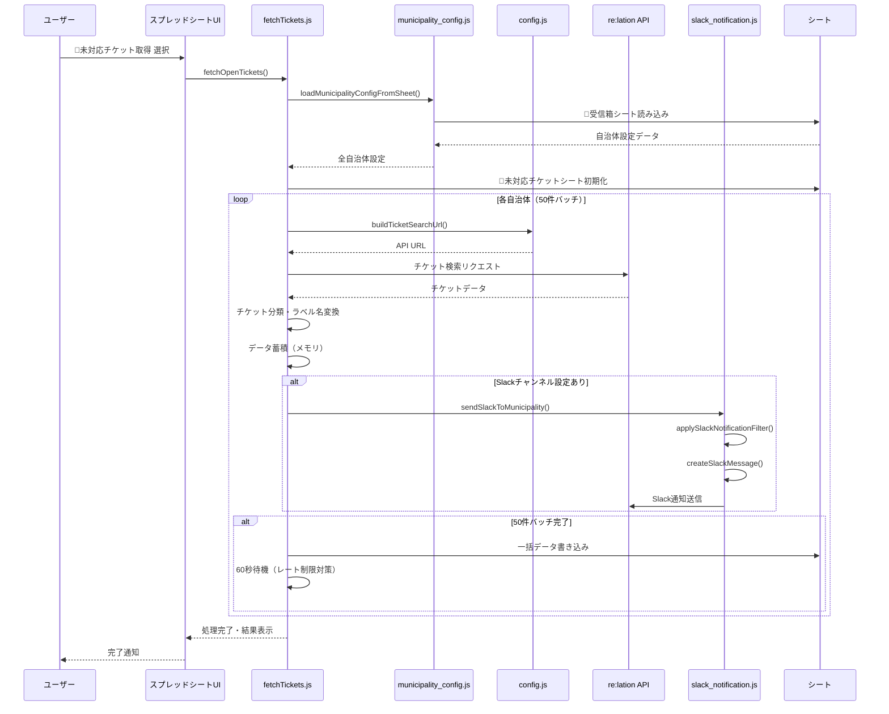
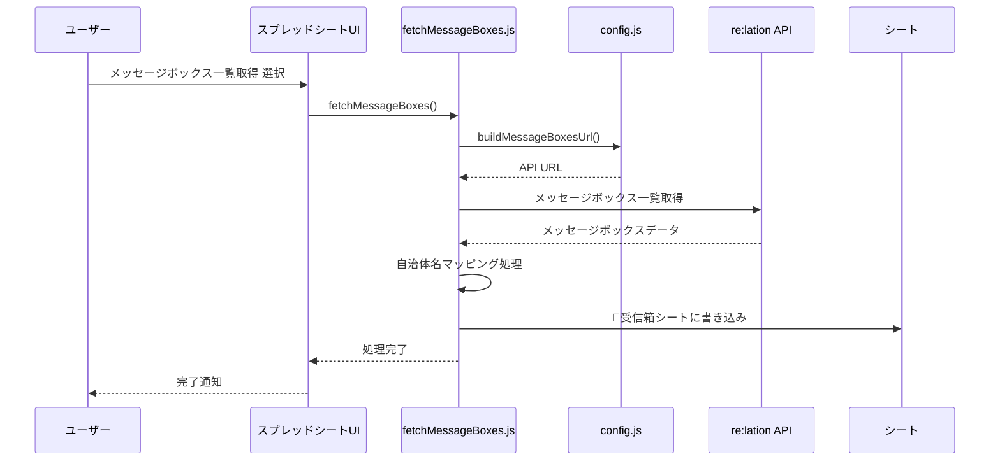
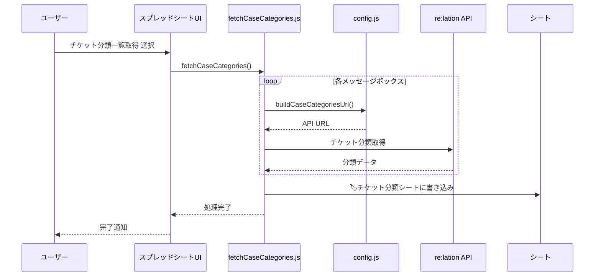
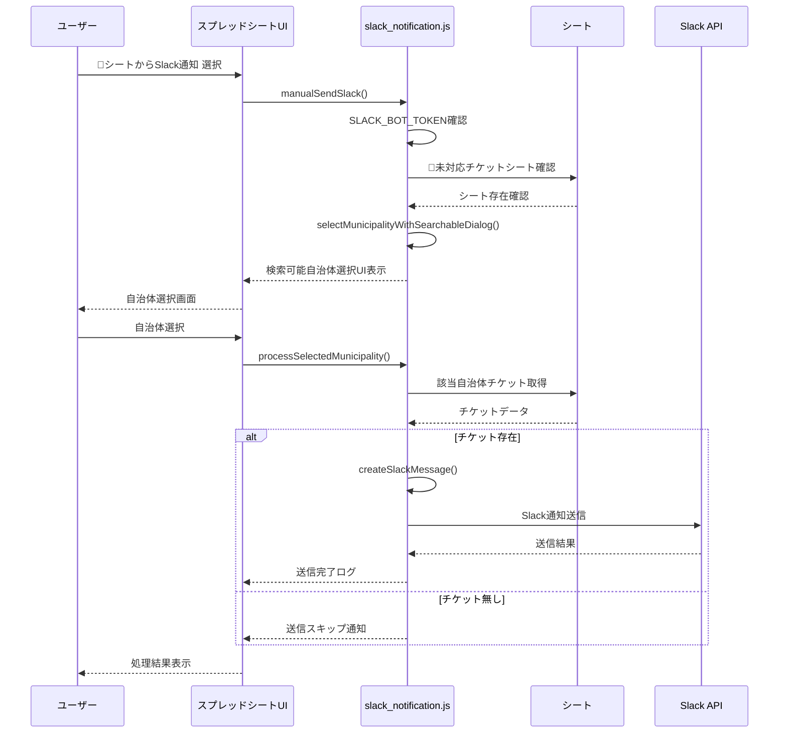
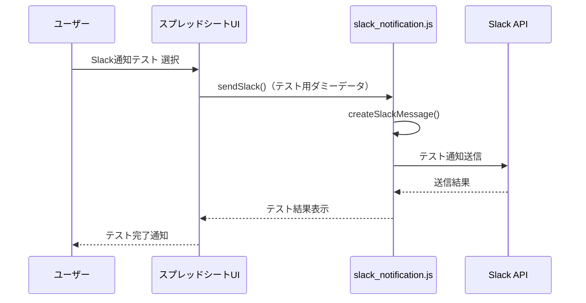
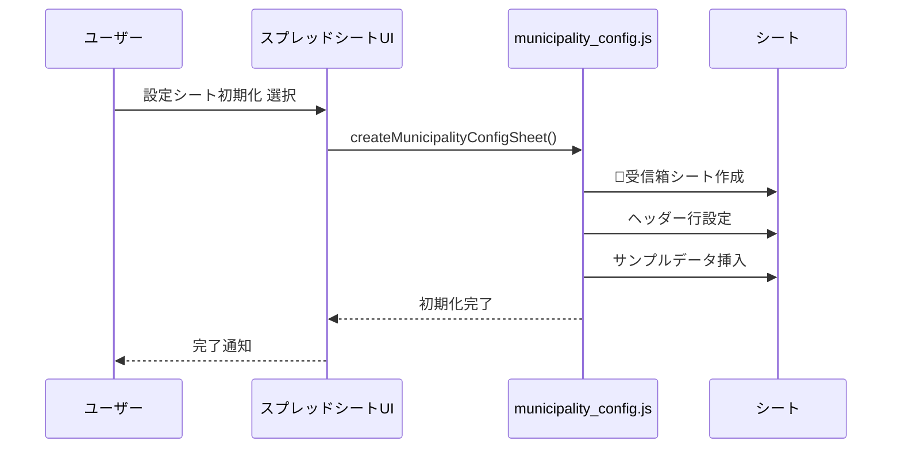

# アーキテクチャとファイル構成

## ファイル構成と関数構成

### config.js（グローバル設定管理）
```
config.js
├── グローバル変数
│   ├── RELATION_SUBDOMAIN (固定: 'steamship')
│   ├── RELATION_BASE_URL
│   └── COMMON_SEARCH_CONDITIONS (全自治体共通の検索条件)
├── 設定取得
│   ├── getCommonSearchConditions()
│   ├── getRelationBaseUrl()
│   └── getRelationApiKey()
└── URL構築
    ├── buildTicketSearchUrl(messageBoxId)
    ├── buildCaseCategoriesUrl(messageBoxId)
    ├── buildMessageBoxesUrl()
    └── buildTicketUrl(messageBoxId, ticketId, status)
```

### municipality_config.js（自治体設定管理）
```
municipality_config.js
├── 設定取得
│   └── loadMunicipalityConfigFromSheet() - シートから設定読み込み
├── JSON解析
│   └── parseSlackNotificationFilter(jsonString) - Slackフィルタ条件解析
└── 初期設定
    └── createMunicipalityConfigSheet() - 設定シート初期化
```

### fetchTickets.js（チケット取得・Slack通知統合）
```
fetchTickets.js
├── チケット取得
│   ├── fetchOpenTickets() - 全自治体チケット取得（メイン機能）
│   └── fetchTicketsForMunicipality(config, ticketType) - 個別自治体チケット取得
├── Slack通知
│   ├── sendSlackToMunicipality(config, tickets) - 自治体別Slack通知
│   └── applySlackNotificationFilter(tickets, config) - フィルタ条件適用
└── ユーティリティ
    └── findMunicipalityConfigByName(municipalityName, configs) - 自治体名で設定検索
```

### slack_notification.js（Slack通知専用）
```
slack_notification.js
├── 手動送信
│   ├── manualSendSlack() - UI付き手動送信
│   ├── selectMunicipalityWithSearchableDialog() - 自治体選択UI
│   └── processSelectedMunicipality(municipalityCode) - 選択処理
├── Slack送信
│   ├── sendSlack(tickets, config) - Slack通知送信
│   └── createSlackMessage(tickets, config) - Slackメッセージ構築
└── ユーティリティ
    └── formatDate(isoString) - 日時フォーマット
```

### fetchMessageBoxes.js（メッセージボックス取得）
```
fetchMessageBoxes.js
├── データ取得
│   └── fetchMessageBoxes() - メッセージボックス一覧取得・シート出力
└── ユーティリティ
    └── findMunicipalityInCodeTable(organizationName, codeTableMap) - 自治体特定
```

### fetchCaseCategories.js（チケット分類取得）
```
fetchCaseCategories.js
└── データ取得
    └── fetchCaseCategories() - チケット分類一覧取得・シート出力
```

### fetchLabels.js（ラベル取得）
```
fetchLabels.js
└── データ取得
    └── fetchLabels() - ラベル一覧取得・シート出力
```

### menu.js（メニュー構成）
```
menu.js
└── UI構成
    └── onOpen() - スプレッドシート起動時メニュー作成
        ├── re:lationメニュー
        │   ├── 全自治体 openチケット取得
        │   ├── メッセージボックス一覧取得
        │   └── チケット分類一覧取得
        ├── Slack通知メニュー
        │   ├── シートからSlack通知
        │   └── Slack通知テスト
        └── 自治体管理メニュー
            └── 設定シート初期化
```

## データフロー（メニュー別シーケンス）

### 1. 全自治体 openチケット取得


### 2. メッセージボックス一覧取得


### 3. チケット分類一覧取得


### 4. シートからSlack通知


### 5. Slack通知テスト


### 6. 設定シート初期化


