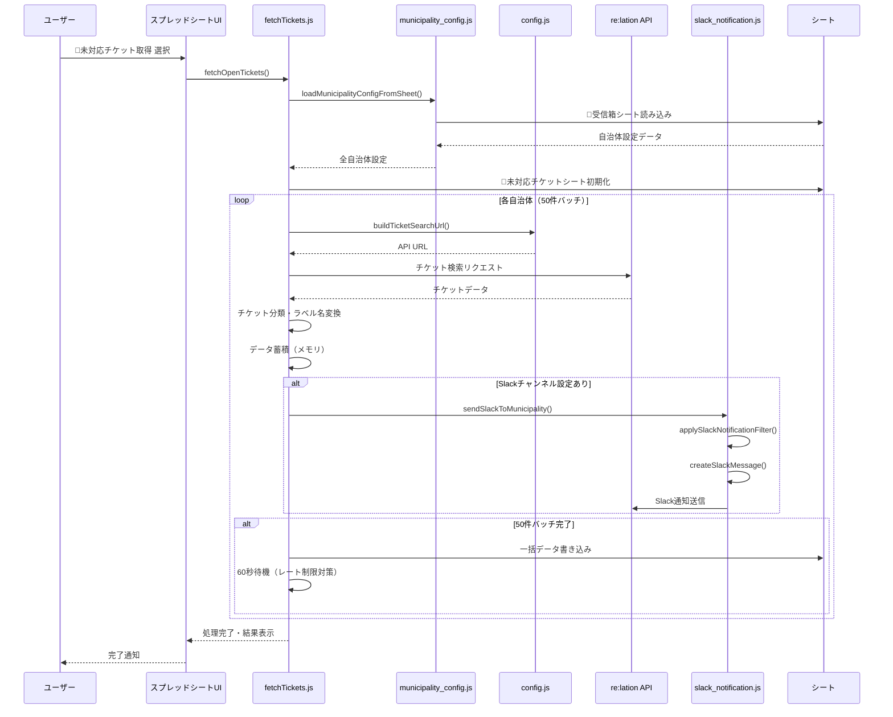
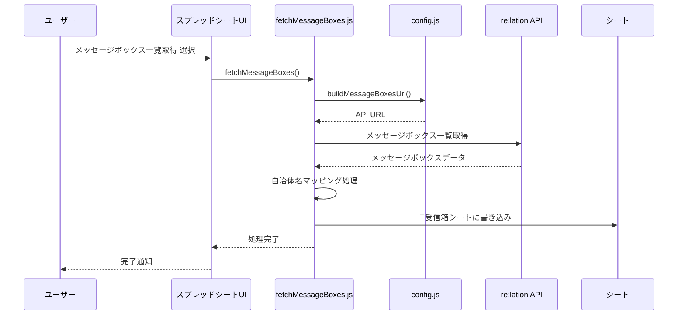
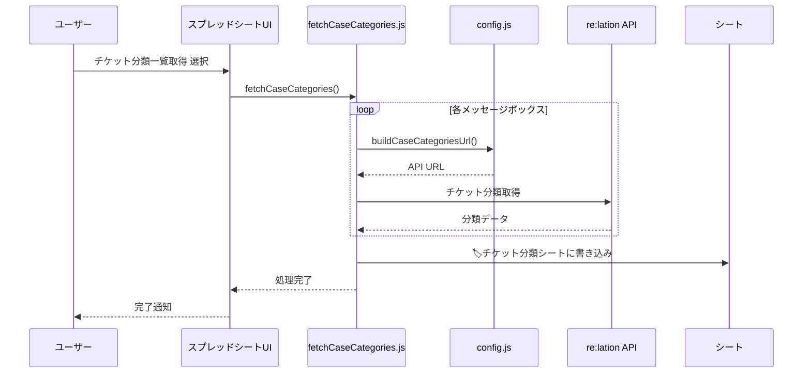
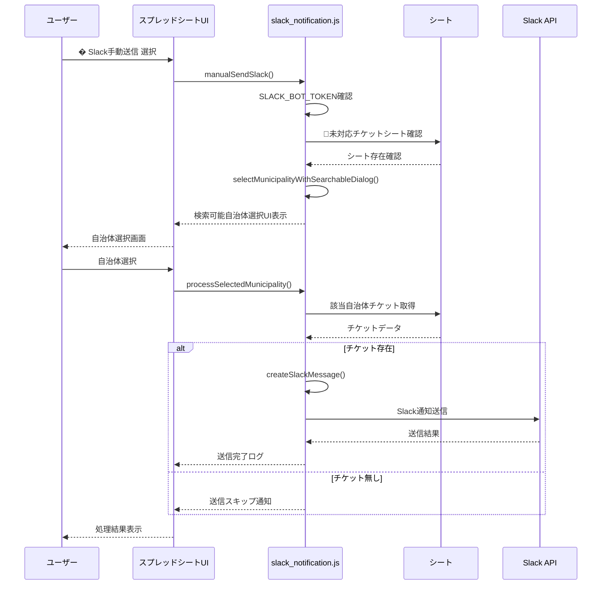

## データフロー（メニュー別シーケンス）

### 1. 全自治体 openチケット取得

```mermaid
sequenceDiagram
    participant User as ユーザー
    participant UI as スプレッドシートUI
    participant FT as fetchTickets.js
    participant MC as municipality_config.js
    participant C as config.js
    participant API as re:lation API
    participant SN as slack_notification.js
    participant Sheet as シート

    User->>UI: 🎫未対応チケット取得 選択
    UI->>FT: fetchOpenTickets()
    FT->>MC: loadMunicipalityConfigFromSheet()
    MC->>Sheet: 📮受信箱シート読み込み
    Sheet-->>MC: 自治体設定データ
    MC-->>FT: 全自治体設定
    
    FT->>Sheet: 🎫未対応チケットシート初期化
    
    loop 各自治体（50件バッチ）
        FT->>C: buildTicketSearchUrl()
        C-->>FT: API URL
        FT->>API: チケット検索リクエスト
        API-->>FT: チケットデータ
        FT->>FT: チケット分類・ラベル名変換
        FT->>FT: データ蓄積（メモリ）
        
        alt Slackチャンネル設定あり
            FT->>SN: sendSlackToMunicipality()
            SN->>SN: applySlackNotificationFilter()
            SN->>SN: createSlackMessage()
            SN->>API: Slack通知送信
        end
        
        alt 50件バッチ完了
            FT->>Sheet: 一括データ書き込み
            FT->>FT: 60秒待機（レート制限対策）
        end
    end
    
    FT-->>UI: 処理完了・結果表示
    UI-->>User: 完了通知
```

### 2. メッセージボックス一覧取得

```mermaid
sequenceDiagram
    participant User as ユーザー
    participant UI as スプレッドシートUI
    participant FMB as fetchMessageBoxes.js
    participant C as config.js
    participant API as re:lation API
    participant Sheet as シート

    User->>UI: メッセージボックス一覧取得 選択
    UI->>FMB: fetchMessageBoxes()
    FMB->>C: buildMessageBoxesUrl()
    C-->>FMB: API URL
    FMB->>API: メッセージボックス一覧取得
    API-->>FMB: メッセージボックスデータ
    FMB->>FMB: 自治体名マッピング処理
    FMB->>Sheet: 📮受信箱シートに書き込み
    FMB-->>UI: 処理完了
    UI-->>User: 完了通知
```

### 3. チケット分類一覧取得

```mermaid
sequenceDiagram
    participant User as ユーザー
    participant UI as スプレッドシートUI
    participant FCC as fetchCaseCategories.js
    participant C as config.js
    participant API as re:lation API
    participant Sheet as シート

    User->>UI: チケット分類一覧取得 選択
    UI->>FCC: fetchCaseCategories()
    
    loop 各メッセージボックス
        FCC->>C: buildCaseCategoriesUrl()
        C-->>FCC: API URL
        FCC->>API: チケット分類取得
        API-->>FCC: 分類データ
    end
    
    FCC->>Sheet: 🏷️チケット分類シートに書き込み
    FCC-->>UI: 処理完了
    UI-->>User: 完了通知
```

### 4. Slack手動送信

```mermaid
sequenceDiagram
    participant User as ユーザー
    participant UI as スプレッドシートUI
    participant SN as slack_notification.js
    participant Sheet as シート
    participant Slack as Slack API

    User->>UI: � Slack手動送信 選択
    UI->>SN: manualSendSlack()
    SN->>SN: SLACK_BOT_TOKEN確認
    SN->>Sheet: 🎫未対応チケットシート確認
    Sheet-->>SN: シート存在確認
    SN->>SN: selectMunicipalityWithSearchableDialog()
    SN-->>UI: 検索可能自治体選択UI表示
    UI-->>User: 自治体選択画面
    
    User->>UI: 自治体選択
    UI->>SN: processSelectedMunicipality()
    SN->>Sheet: 該当自治体チケット取得
    Sheet-->>SN: チケットデータ
    
    alt チケット存在
        SN->>SN: createSlackMessage()
        SN->>Slack: Slack通知送信
        Slack-->>SN: 送信結果
        SN-->>UI: 送信完了ログ
    else チケット無し
        SN-->>UI: 送信スキップ通知
    end
    
    UI-->>User: 処理結果表示
```

