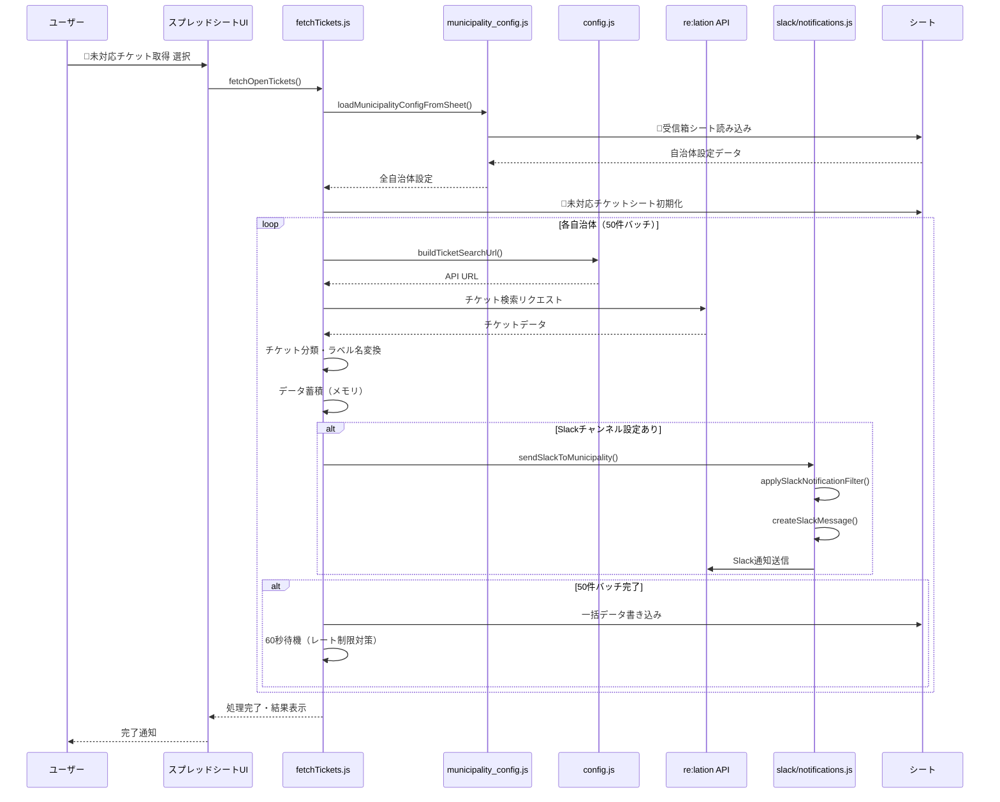
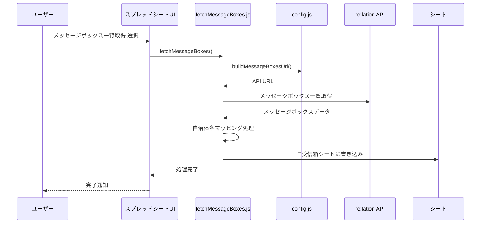
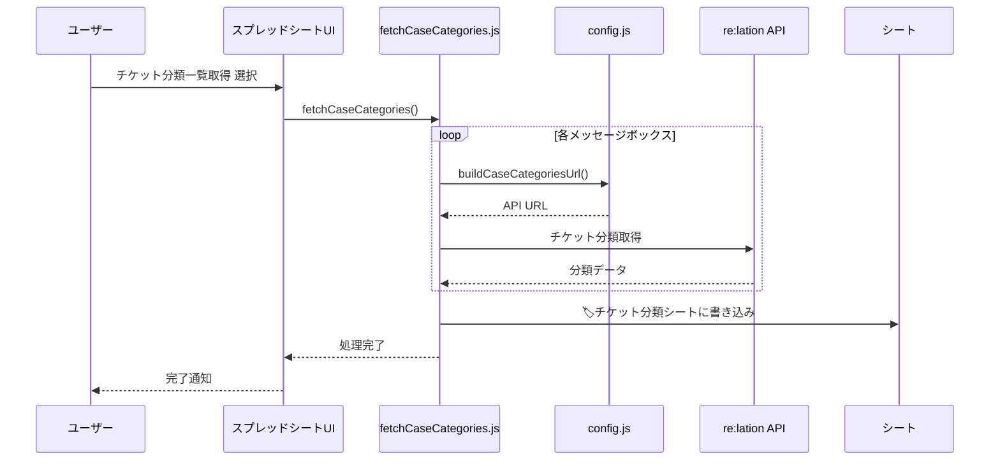
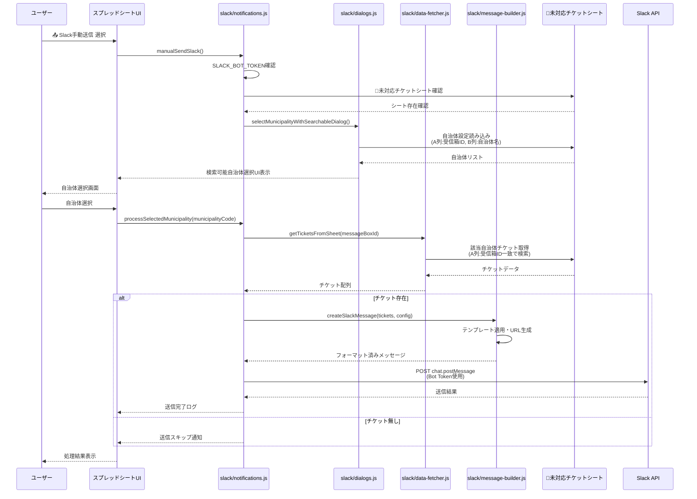
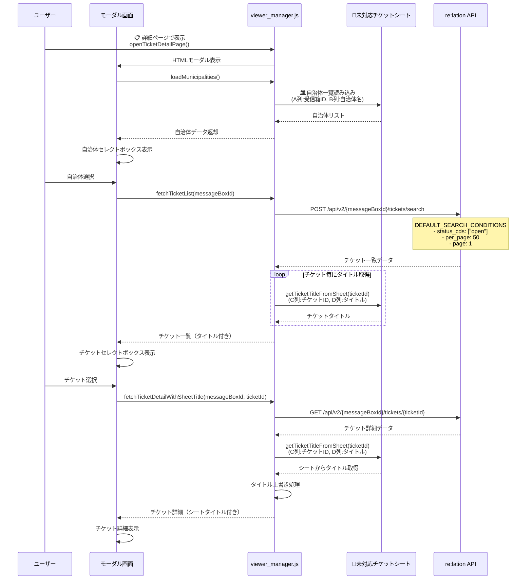
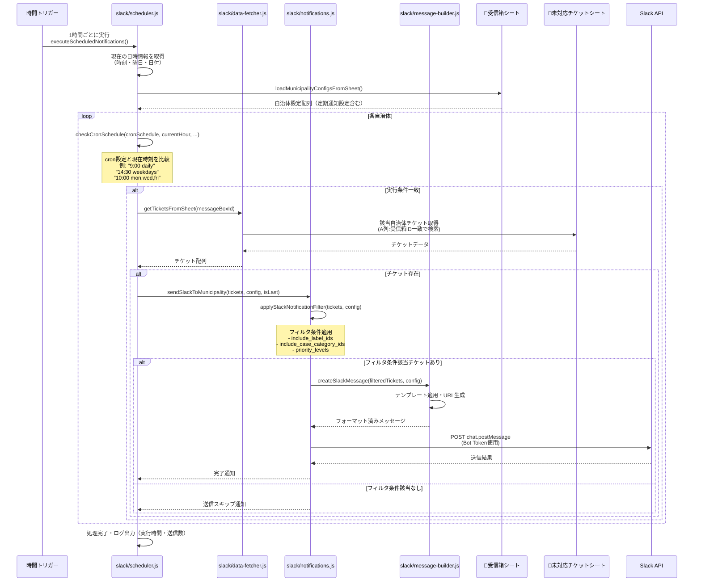
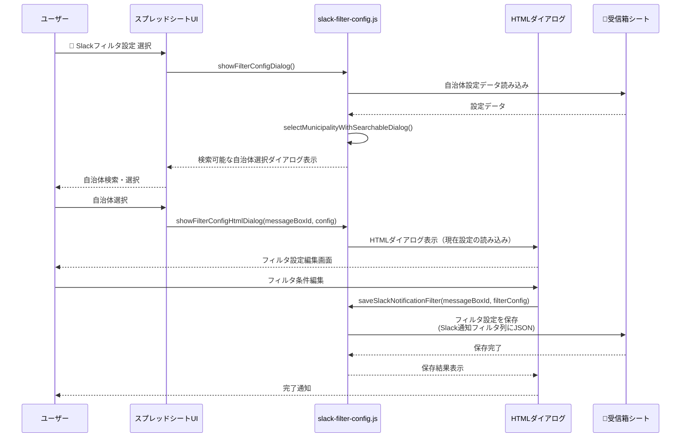
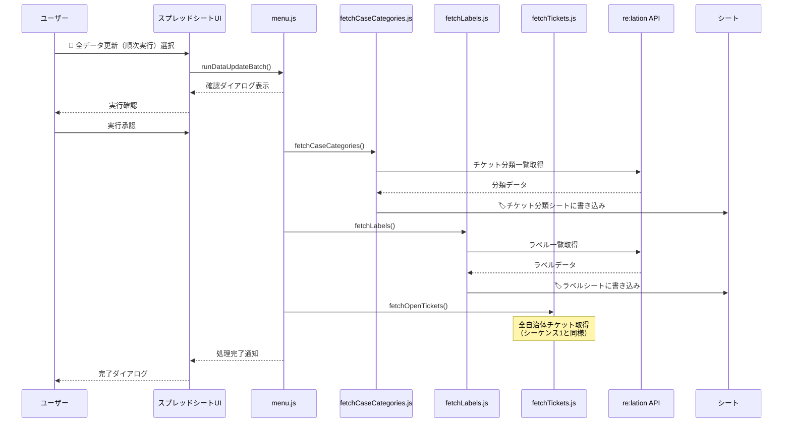
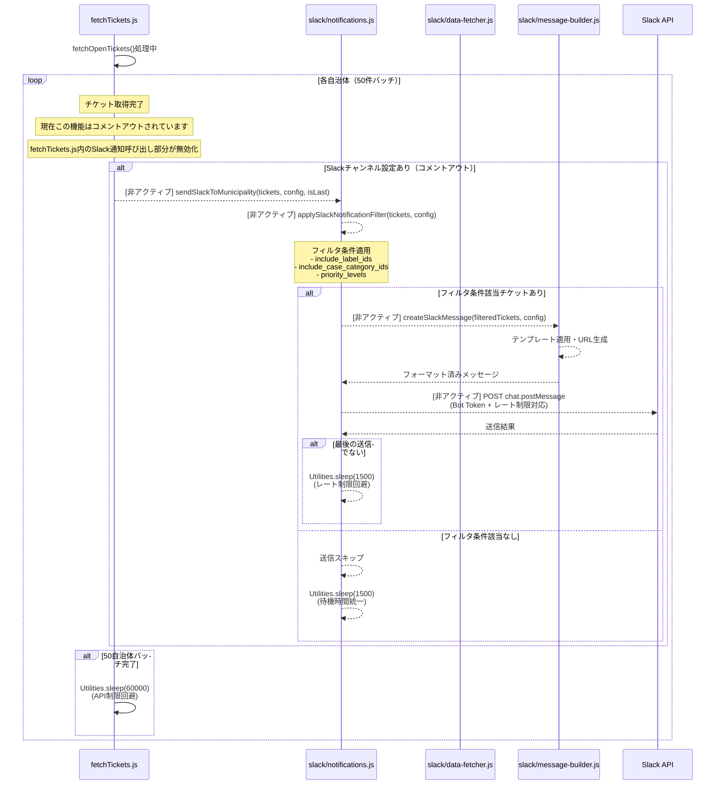
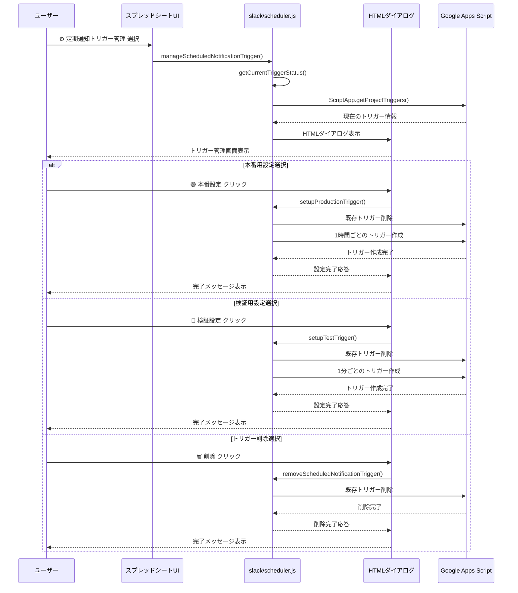

# メニュー別シーケンス

### 1. 全自治体 openチケット取得

### 2. メッセージボックス一覧取得

### 3. チケット分類一覧取得

### 4. Slack手動送信

### 5. チケット詳細確認

### 6. 定期実行のSlack通知（スケジューラー）

### 7. Slackフィルタ設定

### 8. 全データ更新（バッチ処理）

### 9. Slack自動通知（チケット取得時）- 現在コメントアウト

### 10. 定期通知トリガー管理

