# メニュー別シーケンス

### 1. 全自治体 openチケット取得

```mermaid
sequenceDiagram
    participant User as ユーザー
    participant UI as スプレッドシートUI
    participant FT as fetchTickets.js
    participant MC as municipality_config.js
    participant C as config.js
    participant API as re:lation API
    participant Notifications as slack/notifications.js
    participant Sheet as シート

    User->>UI: 🎫未対応チケット取得 選択
    UI->>FT: fetchOpenTickets()
    FT->>MC: loadMunicipalityConfigFromSheet()
    MC->>Sheet: 📮受信箱シート読み込み
    Sheet-->>MC: 自治体設定データ
    MC-->>FT: 全自治体設定
    
    FT->>Sheet: 🎫未対応チケットシート初期化
    
    loop 各自治体（50件バッチ）
        FT->>C: buildTicketSearchUrl()
        C-->>FT: API URL
        FT->>API: チケット検索リクエスト
        API-->>FT: チケットデータ
        FT->>FT: チケット分類・ラベル名変換
        FT->>FT: データ蓄積（メモリ）
        
        alt Slackチャンネル設定あり
            FT->>Notifications: sendSlackToMunicipality()
            Notifications->>Notifications: applySlackNotificationFilter()
            Notifications->>Notifications: createSlackMessage()
            Notifications->>API: Slack通知送信
        end
        
        alt 50件バッチ完了
            FT->>Sheet: 一括データ書き込み
            FT->>FT: 60秒待機（レート制限対策）
        end
    end
    
    FT-->>UI: 処理完了・結果表示
    UI-->>User: 完了通知
```

### 2. メッセージボックス一覧取得

```mermaid
sequenceDiagram
    participant User as ユーザー
    participant UI as スプレッドシートUI
    participant FMB as fetchMessageBoxes.js
    participant C as config.js
    participant API as re:lation API
    participant Sheet as シート

    User->>UI: メッセージボックス一覧取得 選択
    UI->>FMB: fetchMessageBoxes()
    FMB->>C: buildMessageBoxesUrl()
    C-->>FMB: API URL
    FMB->>API: メッセージボックス一覧取得
    API-->>FMB: メッセージボックスデータ
    FMB->>FMB: 自治体名マッピング処理
    FMB->>Sheet: 📮受信箱シートに書き込み
    FMB-->>UI: 処理完了
    UI-->>User: 完了通知
```

### 3. チケット分類一覧取得

```mermaid
sequenceDiagram
    participant User as ユーザー
    participant UI as スプレッドシートUI
    participant FCC as fetchCaseCategories.js
    participant C as config.js
    participant API as re:lation API
    participant Sheet as シート

    User->>UI: チケット分類一覧取得 選択
    UI->>FCC: fetchCaseCategories()
    
    loop 各メッセージボックス
        FCC->>C: buildCaseCategoriesUrl()
        C-->>FCC: API URL
        FCC->>API: チケット分類取得
        API-->>FCC: 分類データ
    end
    
    FCC->>Sheet: 🏷️チケット分類シートに書き込み
    FCC-->>UI: 処理完了
    UI-->>User: 完了通知
```

### 4. Slack手動送信

```mermaid
sequenceDiagram
    participant User as ユーザー
    participant UI as スプレッドシートUI
    participant Notifications as slack/notifications.js
    participant Dialogs as slack/dialogs.js
    participant DataFetcher as slack/data-fetcher.js
    participant MessageBuilder as slack/message-builder.js
    participant TicketSheet as 🎫未対応チケットシート
    participant Slack as Slack API

    User->>UI: 📤 Slack手動送信 選択
    UI->>Notifications: manualSendSlack()
    Notifications->>Notifications: SLACK_BOT_TOKEN確認
    Notifications->>TicketSheet: 🎫未対応チケットシート確認
    TicketSheet-->>Notifications: シート存在確認
    
    %% 自治体選択フロー
    Notifications->>Dialogs: selectMunicipalityWithSearchableDialog()
    Dialogs->>TicketSheet: 自治体設定読み込み<br/>(A列:受信箱ID, B列:自治体名)
    TicketSheet-->>Dialogs: 自治体リスト
    Dialogs-->>UI: 検索可能自治体選択UI表示
    UI-->>User: 自治体選択画面
    
    %% 自治体選択後の処理
    User->>UI: 自治体選択
    UI->>Notifications: processSelectedMunicipality(municipalityCode)
    Notifications->>DataFetcher: getTicketsFromSheet(messageBoxId)
    DataFetcher->>TicketSheet: 該当自治体チケット取得<br/>(A列:受信箱ID一致で検索)
    TicketSheet-->>DataFetcher: チケットデータ
    DataFetcher-->>Notifications: チケット配列
    
    alt チケット存在
        %% メッセージ作成・送信フロー
        Notifications->>MessageBuilder: createSlackMessage(tickets, config)
        MessageBuilder->>MessageBuilder: テンプレート適用・URL生成
        MessageBuilder-->>Notifications: フォーマット済みメッセージ
        Notifications->>Slack: POST chat.postMessage<br/>(Bot Token使用)
        Slack-->>Notifications: 送信結果
        Notifications-->>UI: 送信完了ログ
    else チケット無し
        Notifications-->>UI: 送信スキップ通知
    end
    
    UI-->>User: 処理結果表示
```

### 5. チケット詳細確認

```mermaid
sequenceDiagram
    participant User as ユーザー
    participant Modal as モーダル画面
    participant VM as viewer_manager.js
    participant TicketSheet as 🎫未対応チケットシート
    participant API as re:lation API
    
    %% 初期化フロー
    User->>VM: 📋 詳細ページで表示<br/>openTicketDetailPage()
    VM->>Modal: HTMLモーダル表示
    Modal->>VM: loadMunicipalities()
    VM->>TicketSheet: 🏛️自治体一覧読み込み<br/>(A列:受信箱ID, B列:自治体名)
    TicketSheet-->>VM: 自治体リスト
    VM-->>Modal: 自治体データ返却
    Modal->>Modal: 自治体セレクトボックス表示
    
    %% チケット一覧取得フロー
    User->>Modal: 自治体選択
    Modal->>VM: fetchTicketList(messageBoxId)
    VM->>API: POST /api/v2/{messageBoxId}/tickets/search
    Note over API: DEFAULT_SEARCH_CONDITIONS<br/>- status_cds: ["open"]<br/>- per_page: 50<br/>- page: 1
    API-->>VM: チケット一覧データ
    
    loop チケット毎にタイトル取得
        VM->>TicketSheet: getTicketTitleFromSheet(ticketId)<br/>(C列:チケットID, D列:タイトル)
        TicketSheet-->>VM: チケットタイトル
    end
    
    VM-->>Modal: チケット一覧（タイトル付き）
    Modal->>Modal: チケットセレクトボックス表示
    
    %% チケット詳細表示フロー
    User->>Modal: チケット選択
    Modal->>VM: fetchTicketDetailWithSheetTitle(messageBoxId, ticketId)
    VM->>API: GET /api/v2/{messageBoxId}/tickets/{ticketId}
    API-->>VM: チケット詳細データ
    VM->>TicketSheet: getTicketTitleFromSheet(ticketId)<br/>(C列:チケットID, D列:タイトル)
    TicketSheet-->>VM: シートからタイトル取得
    VM->>VM: タイトル上書き処理
    VM-->>Modal: チケット詳細（シートタイトル付き）
    Modal->>Modal: チケット詳細表示
```

### 6. 定期通知スケジューラー

```mermaid
sequenceDiagram
    participant Scheduler as scheduler.js
    participant DataFetcher as data-fetcher.js
    participant Notifications as notifications.js
    participant Sheet as 📮受信箱シート
    participant TicketSheet as 🎫未対応チケットシート
    participant Slack as Slack API
    
    %% 定期実行開始
    Scheduler->>Scheduler: executeScheduledNotifications()
    Scheduler->>Scheduler: 現在の日時情報を取得
    
    %% 自治体設定取得
    Scheduler->>Sheet: loadMunicipalityConfigsFromSheet()
    Sheet-->>Scheduler: 自治体設定配列（定期通知設定含む）
    
    loop 各自治体
        Scheduler->>Scheduler: checkCronSchedule()
        Note over Scheduler: cron設定と現在時刻を比較<br/>例: "9:00 daily"<br/>"14:30 weekdays"
        
        alt 実行条件一致
            Scheduler->>DataFetcher: getTicketsFromSheet(messageBoxId)
            DataFetcher->>TicketSheet: 該当自治体チケット取得
            TicketSheet-->>DataFetcher: チケットデータ
            DataFetcher-->>Scheduler: チケット配列
            
            alt チケット存在
                Scheduler->>Notifications: sendSlackToMunicipality(tickets, config, isLast)
                Notifications->>Notifications: applySlackNotificationFilter()
                Notifications->>Notifications: createSlackMessage()
                Notifications->>Slack: POST chat.postMessage<br/>(Bot Token使用)
                Slack-->>Notifications: 送信結果
                Notifications-->>Scheduler: 完了通知
            end
        end
    end
    
    Scheduler->>Scheduler: 処理完了・ログ出力
```

### 7. Slackフィルタ設定

```mermaid
sequenceDiagram
    participant User as ユーザー
    participant UI as スプレッドシートUI
    participant FilterConfig as slack-filter-config.js
    participant Dialog as HTMLダイアログ
    participant Sheet as 📮受信箱シート
    
    User->>UI: 🔧 Slackフィルタ設定 選択
    UI->>FilterConfig: showFilterConfigDialog()
    FilterConfig->>Sheet: 自治体設定データ読み込み
    Sheet-->>FilterConfig: 設定データ
    FilterConfig->>FilterConfig: selectMunicipalityWithSearchableDialog()
    FilterConfig-->>UI: 検索可能な自治体選択ダイアログ表示
    UI-->>User: 自治体検索・選択
    
    User->>UI: 自治体選択
    UI->>FilterConfig: showFilterConfigHtmlDialog(messageBoxId, config)
    FilterConfig->>Dialog: HTMLダイアログ表示（現在設定の読み込み）
    Dialog-->>User: フィルタ設定編集画面
    
    User->>Dialog: フィルタ条件編集
    Dialog->>FilterConfig: saveSlackNotificationFilter(messageBoxId, filterConfig)
    FilterConfig->>Sheet: フィルタ設定を保存<br/>(Slack通知フィルタ列にJSON)
    Sheet-->>FilterConfig: 保存完了
    FilterConfig-->>Dialog: 保存結果表示
    Dialog-->>User: 完了通知
```

### 8. 全データ更新（バッチ処理）

```mermaid
sequenceDiagram
    participant User as ユーザー
    participant UI as スプレッドシートUI
    participant Menu as menu.js
    participant FCC as fetchCaseCategories.js
    participant FL as fetchLabels.js
    participant FT as fetchTickets.js
    participant API as re:lation API
    participant Sheet as シート
    
    User->>UI: 🔄 全データ更新（順次実行）選択
    UI->>Menu: runDataUpdateBatch()
    Menu-->>UI: 確認ダイアログ表示
    UI-->>User: 実行確認
    User->>UI: 実行承認
    
    %% 1. チケット分類取得
    Menu->>FCC: fetchCaseCategories()
    FCC->>API: チケット分類一覧取得
    API-->>FCC: 分類データ
    FCC->>Sheet: 🏷️チケット分類シートに書き込み
    
    %% 2. ラベル取得
    Menu->>FL: fetchLabels()
    FL->>API: ラベル一覧取得
    API-->>FL: ラベルデータ
    FL->>Sheet: 🏷️ラベルシートに書き込み
    
    %% 3. 未対応チケット取得
    Menu->>FT: fetchOpenTickets()
    Note over FT: 全自治体チケット取得<br/>（シーケンス1と同様）
    
    Menu-->>UI: 処理完了通知
    UI-->>User: 完了ダイアログ
```

### 9. Slack自動通知（チケット取得時）- 現在コメントアウト

```mermaid
sequenceDiagram
    participant FT as fetchTickets.js
    participant Notifications as slack/notifications.js
    participant DataFetcher as slack/data-fetcher.js
    participant MessageBuilder as slack/message-builder.js
    participant Slack as Slack API

    %% 全自治体チケット取得中の通知フロー
    FT->>FT: fetchOpenTickets()処理中
    
    loop 各自治体（50件バッチ）
        Note over FT: チケット取得完了
        
        %% ※※※現在この処理はコメントアウトされています※※※
        Note over FT: 現在この機能はコメントアウトされています
        Note over FT: fetchTickets.js内のSlack通知呼び出し部分が無効化
        
        alt Slackチャンネル設定あり（コメントアウト）
            FT-->>Notifications: [非アクティブ] sendSlackToMunicipality(tickets, config, isLast)
            Notifications-->>Notifications: [非アクティブ] applySlackNotificationFilter(tickets, config)
            Note over Notifications: フィルタ条件適用<br/>- include_label_ids<br/>- include_case_category_ids<br/>- priority_levels
            
            alt フィルタ条件該当チケットあり
                Notifications-->>MessageBuilder: [非アクティブ] createSlackMessage(filteredTickets, config)
                MessageBuilder-->>MessageBuilder: テンプレート適用・URL生成
                MessageBuilder-->>Notifications: フォーマット済みメッセージ
                Notifications-->>Slack: [非アクティブ] POST chat.postMessage<br/>(Bot Token + レート制限対応)
                Slack-->>Notifications: 送信結果
                
                alt 最後の送信でない
                    Notifications-->>Notifications: Utilities.sleep(1500)<br/>(レート制限回避)
                end
            else フィルタ条件該当なし
                Notifications-->>Notifications: 送信スキップ
                Notifications-->>Notifications: Utilities.sleep(1500)<br/>(待機時間統一)
            end
        end
        
        alt 50自治体バッチ完了
            FT->>FT: Utilities.sleep(60000)<br/>(API制限回避)
        end
    end
```

