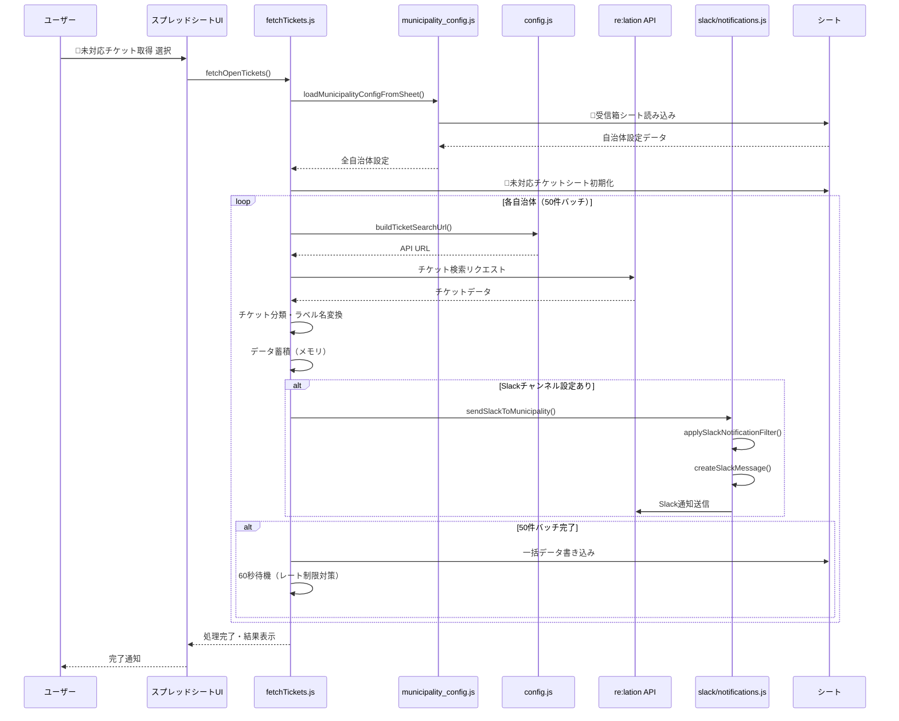
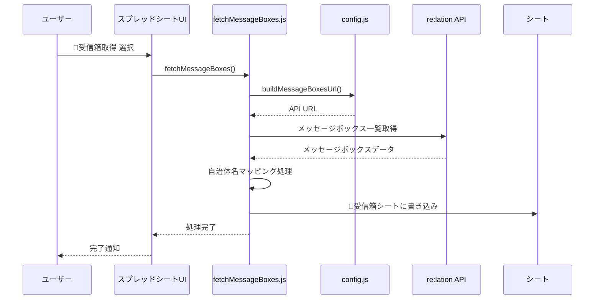
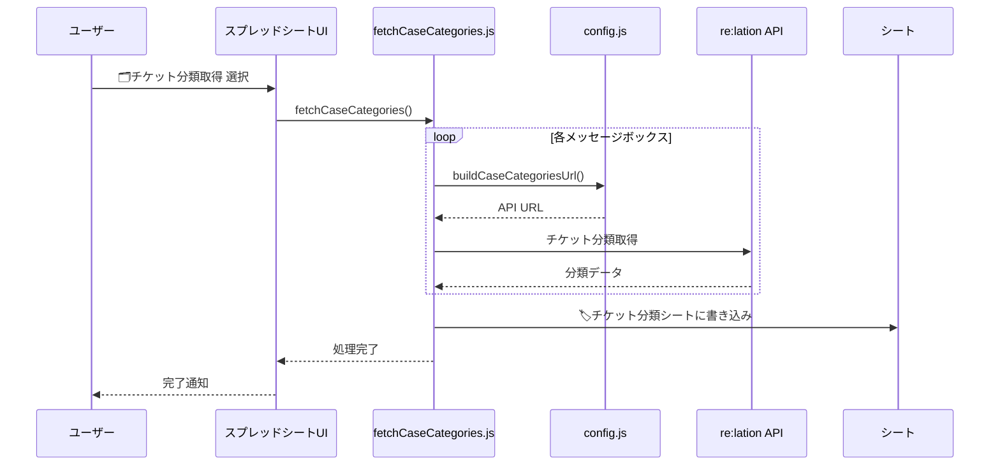
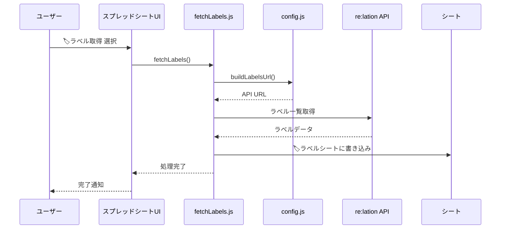
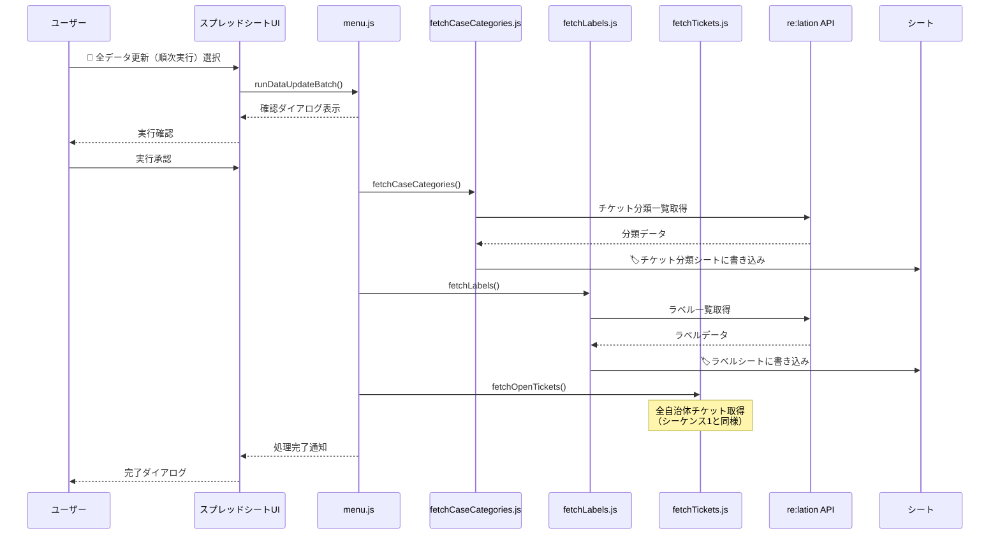
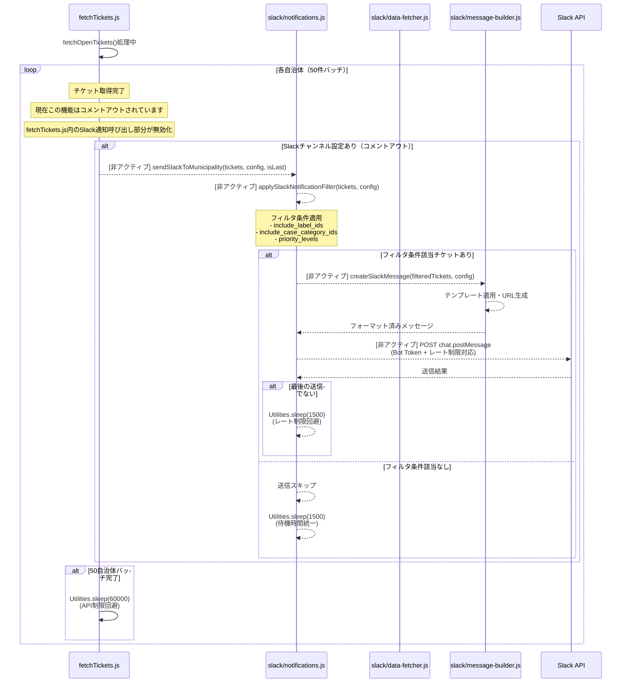

# 🟩 re:lation メニュー シーケンス

このファイルでは、re:lationメニューに含まれる機能のシーケンス図を解説します。

## 1. 全自治体 openチケット取得

## 2. メッセージボックス一覧取得

## 3. チケット分類一覧取得

## 4. ラベル一覧取得

## 5. 全データ更新（バッチ処理）

## 9. Slack自動通知（チケット取得時）- 現在コメントアウト

