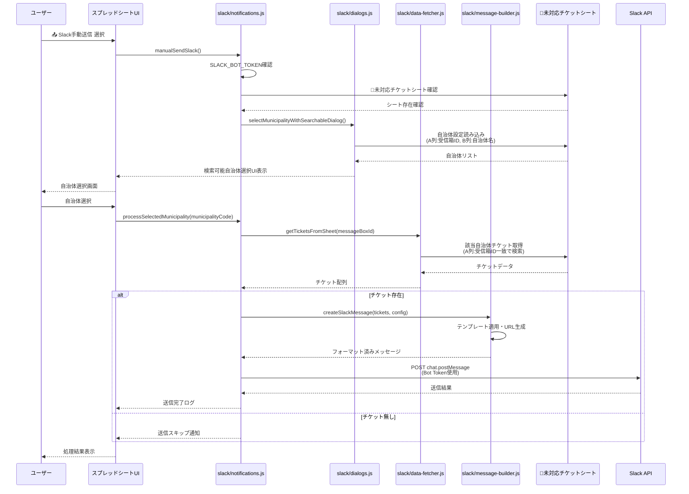
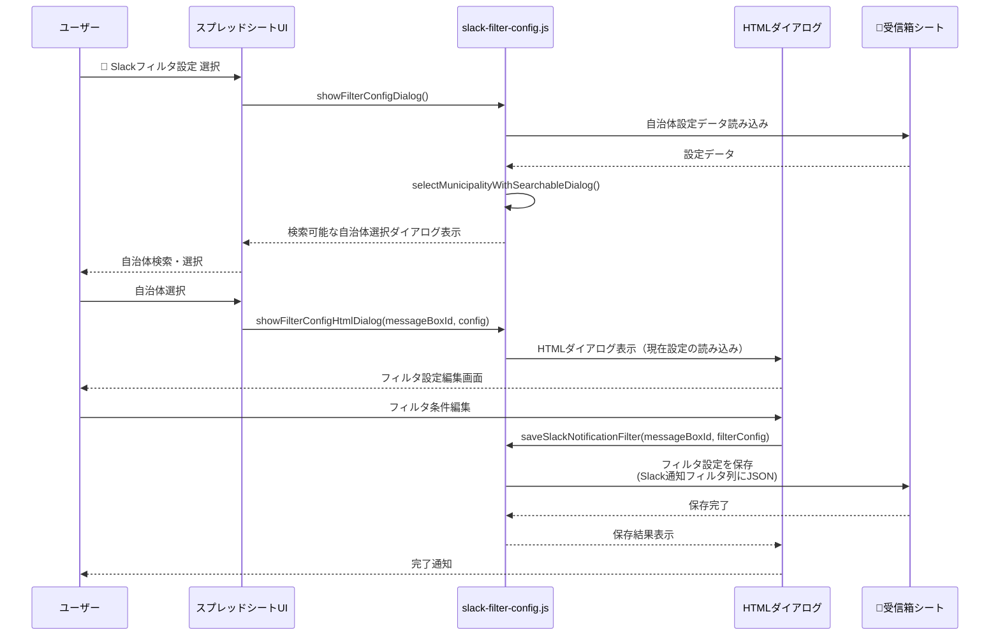
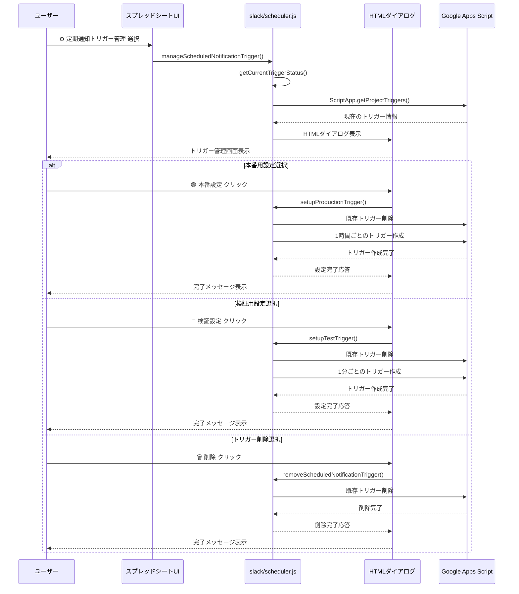
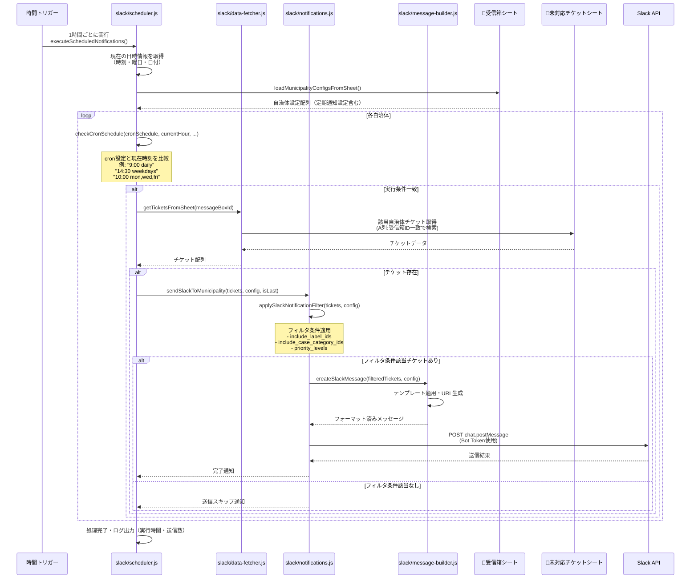

# 🔔 Slack メニュー シーケンス

このファイルでは、Slackメニューに含まれる機能のシーケンス図を解説します。

## 目次
- [1. Slack手動送信](#1-slack手動送信)
- [2. Slackフィルタ設定](#2-slackフィルタ設定)
- [3. 定期通知トリガー管理](#3-定期通知トリガー管理)
- [4. 定期実行のSlack通知（スケジューラー）](#4-定期実行のslack通知スケジューラー)

## 1. Slack手動送信

## 2. Slackフィルタ設定

## 3. 定期通知トリガー管理

## 4. 定期実行のSlack通知（スケジューラー）

