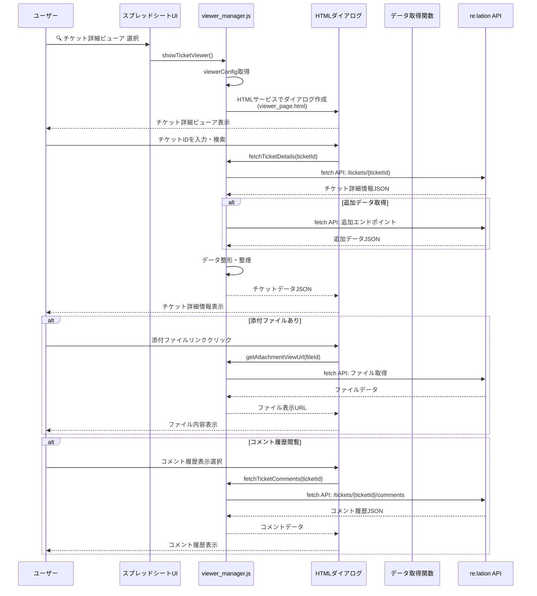

# 🔍 tool メニュー シーケンス

このファイルでは、toolメニューに含まれる機能のシーケンス図を解説します。

## 1. チケット詳細ビューア

```mermaid
sequenceDiagram
    participant User as ユーザー
    participant UI as スプレッドシートUI
    participant ViewerManager as viewer_manager.js
    participant Dialog as HTMLダイアログ
    participant DataFetcher as データ取得関数
    participant Relation as re:lation API

    %% チケットビューア起動フロー
    User->>UI: 🔍 チケット詳細ビューア 選択
    UI->>ViewerManager: showTicketViewer()
    ViewerManager->>ViewerManager: viewerConfig取得
    ViewerManager->>Dialog: HTMLサービスでダイアログ作成<br/>(viewer_page.html)
    Dialog-->>User: チケット詳細ビューア表示
    
    %% チケット検索フロー
    User->>Dialog: チケットIDを入力・検索
    Dialog->>ViewerManager: fetchTicketDetails(ticketId)
    ViewerManager->>Relation: fetch API: /tickets/{ticketId}
    Relation-->>ViewerManager: チケット詳細情報JSON
    
    %% 追加データ取得フロー（必要に応じて）
    alt 追加データ取得
        ViewerManager->>Relation: fetch API: 追加エンドポイント
        Relation-->>ViewerManager: 追加データJSON
    end
    
    ViewerManager->>ViewerManager: データ整形・整理
    ViewerManager-->>Dialog: チケットデータJSON
    Dialog-->>User: チケット詳細情報表示

    %% 添付ファイル関連
    alt 添付ファイルあり
        User->>Dialog: 添付ファイルリンククリック
        Dialog->>ViewerManager: getAttachmentViewUrl(fileId)
        ViewerManager->>Relation: fetch API: ファイル取得
        Relation-->>ViewerManager: ファイルデータ
        ViewerManager-->>Dialog: ファイル表示URL
        Dialog-->>User: ファイル内容表示
    end

    %% コメントや返信の閲覧
    alt コメント履歴閲覧
        User->>Dialog: コメント履歴表示選択
        Dialog->>ViewerManager: fetchTicketComments(ticketId)
        ViewerManager->>Relation: fetch API: /tickets/{ticketId}/comments
        Relation-->>ViewerManager: コメント履歴JSON
        ViewerManager-->>Dialog: コメントデータ
        Dialog-->>User: コメント履歴表示
    end
```
