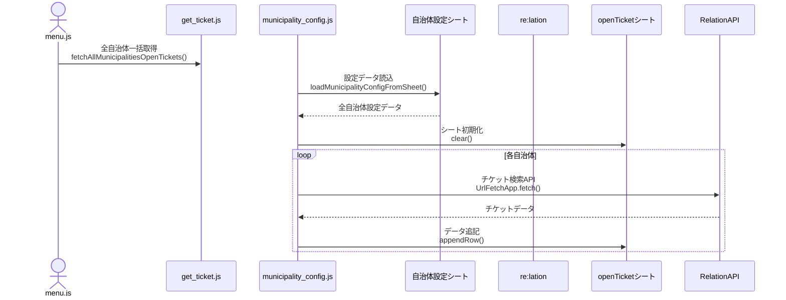
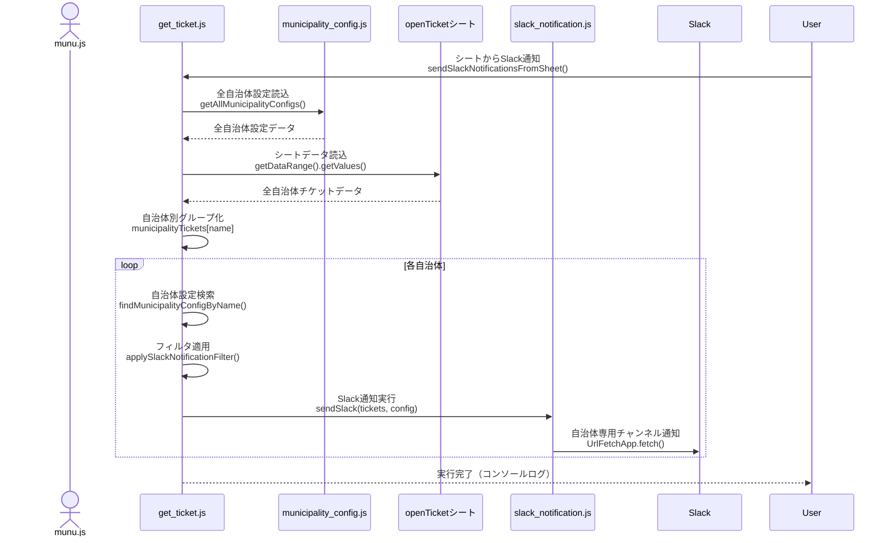
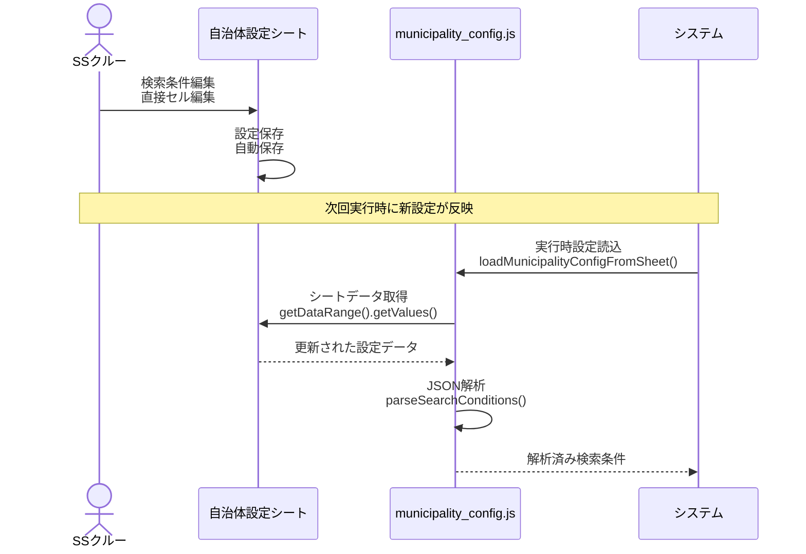

# 全自治体向けre:lation連携システム

複数自治体のre:lationチケット情報を統合管理し、Slackに通知するシステムです。

## 設計方針

**基本コンセプト:**
- 1つのシートに全自治体分のopenチケットを集約
- 1つのシートに全自治体分のre:lation設定とSlack通知設定を集約
- エンジニアでなくても設定変更が容易
- 自治体横断的な残チケットメンテナンスを実現

## ファイル構成と関数構成

### config.js（グローバル設定管理）
```
config.js
├── グローバル変数
│   ├── RELATION_SUBDOMAIN (固定: 'steamship')
│   ├── RELATION_BASE_URL
│   └── COMMON_SEARCH_CONDITIONS (全自治体共通の検索条件)
├── 設定取得
│   ├── getCommonSearchConditions()
│   ├── getRelationBaseUrl()
│   └── getRelationApiKey()
└── URL構築
    ├── buildTicketSearchUrl(messageBoxId)
    ├── buildCaseCategoriesUrl(messageBoxId)
    ├── buildMessageBoxesUrl()
    └── buildTicketUrl(messageBoxId, ticketId, status)
```

### municipality_config.js（自治体設定管理）
```
municipality_config.js
├── 設定取得
│   ├── getMunicipalityConfig(municipalityId) - 個別自治体設定取得
│   ├── getAllMunicipalityConfigs() - 全自治体設定取得
│   └── loadMunicipalityConfigFromSheet() - シートから設定読み込み
├── JSON解析
│   └── parseSlackNotificationFilter(jsonString) - Slackフィルタ条件解析
└── 初期設定
    └── createMunicipalityConfigSheet() - 設定シート初期化
```

### get_ticket.js（チケット取得・Slack通知統合）
```
get_ticket.js
├── チケット取得
│   ├── fetchAllMunicipalitiesOpenTickets() - 全自治体チケット取得（メイン機能）
│   └── fetchTicketsForMunicipality(config, ticketType) - 個別自治体チケット取得
├── Slack通知
│   ├── sendSlackNotificationsFromSheet() - シートデータからSlack通知
│   ├── sendSlackToMunicipality(tickets, config) - 自治体別Slack通知
│   └── applySlackNotificationFilter(tickets, config) - フィルタ条件適用
└── ユーティリティ
    └── findMunicipalityConfigByName(municipalityName, configs) - 自治体名で設定検索
```

### slack_notification.js（Slack通知専用）
```
slack_notification.js
├── Slack送信
│   ├── testSendSlack(customMessage, channel) - テスト送信
│   └── sendSlack(tickets, config) - Slack通知送信
├── メッセージ作成
│   ├── createSlackMessage(tickets, config) - Slackメッセージ構築
│   └── getSlackMessageTemplate(config) - テンプレート取得
└── ユーティリティ
    └── formatDate(isoString) - 日時フォーマット
```

### get_messagebox.js（メッセージボックス取得）
```
get_messagebox.js
└── データ取得
    └── fetchMessageBoxes() - メッセージボックス一覧取得・シート出力
```

### get_case_categories.js（チケット分類取得）
```
get_case_categories.js
└── データ取得
    └── fetchCaseCategories() - チケット分類一覧取得・シート出力
```

### menu.js（メニュー構成）
```
menu.js
└── UI構成
    └── onOpen() - スプレッドシート起動時メニュー作成
        ├── re:lationメニュー
        │   ├── 全自治体 openチケット取得
        │   ├── メッセージボックス一覧取得
        │   └── チケット分類一覧取得
        ├── Slack通知メニュー
        │   ├── シートからSlack通知
        │   └── Slack通知テスト
        └── 自治体管理メニュー
            └── 設定シート初期化
```

## 機能

### 統合チケット管理
- **全自治体一括取得**: `fetchAllMunicipalitiesOpenTickets()` - 全自治体のopenチケットを1つのシートに集約
- **横断的管理**: 全自治体のチケット状況を1つのシートで一覧表示

### Slack通知
- **テスト通知**: `testSendSlack()` - 動作確認用テストメッセージ送信

### 設定管理
- **スプレッドシートベース**: 「自治体設定」シートで全設定を一元管理
- **職員による直接編集**: エンジニア不要でJSON設定を直接編集可能
- **シート初期化**: `createMunicipalityConfigSheet()` - 設定シートの自動作成

## スプレッドシート構成

### 「openTicket」シート（全自治体統合）
全自治体のopenチケットを1つのシートで管理：

| 自治体名 | ID | タイトル | ステータス | 作成日 | 更新日 | チケット分類ID | ラベルID | 保留理由ID |
|---------|----|---------|---------|---------|---------|--------------|---------|-----------| 
| 山鹿市 | 12345 | 道路修繕要望 | open | 2025-07-28 | 2025-07-29 | 101,102 | urgent | |
| 福岡市 | 67890 | 公園清掃依頼 | open | 2025-07-29 | 2025-07-29 | 201 | | |

**特徴:**
- 自治体名で各チケットを識別
- タイトルにはre:lationへの直リンクを設定
- 各自治体実行時は該当自治体の既存データのみ更新

### 「自治体設定」シート（設定一元管理）
全自治体の設定を1つのシートで管理：

| 自治体ID | 自治体名 | 都道府県 | サブドメイン | 受信箱ID | Slackチャンネル | 検索条件(JSON) | Slack通知テンプレート(JSON) |
|---------|---------|---------|-------------|-------------------|----------------|---------------|---------------------------|
| yamaga | 山鹿市 | 熊本県 | steamship | 629 | #yamaga-tickets | (下記JSON参照) | (下記テンプレート参照) |
| fukuoka | 福岡市 | 福岡県 | fukuoka | 456 | #fukuoka-tickets | (下記JSON参照) | (下記テンプレート参照) |

## セットアップ

1. Google Apps Scriptのスクリプトプロパティに以下を設定：
   - `SLACK_WEBHOOK_URL`: Slack Incoming WebhookのURL
   - `RELATION_API_KEY`: re:lation APIキー

2. メニューから「🏛️ 自治体管理」→「設定シート初期化」を実行
   - 「自治体設定」シートが自動作成される
   - 山鹿市の初期設定が設定される

3. 各自治体の設定を「自治体設定」シートで編集：
   - 基本情報（自治体ID、名前、サブドメイン等）
   - Slackチャンネル（#自治体名-tickets形式推奨）
   - 検索条件JSON（後述の例を参照）
   - Slack通知テンプレートJSON（後述の例を参照）

## メニュー構成

### 🟩 re:lation
- **全自治体 openチケット取得**: 全自治体のチケットを一括で取得・統合
- **メッセージボックス一覧取得**: 現在の自治体のメッセージボックス情報を取得
- **チケット分類一覧取得**: 現在の自治体のチケット分類情報を取得

### 🔔 Slack通知
- **特定自治体に通知**: 指定した自治体にのみSlack通知を送信
- **Slack通知テスト**: 動作確認用のテストメッセージを送信

### 🏛️ 自治体管理
- **設定シート初期化**: 「自治体設定」シートを作成・初期化

## 運用ワークフロー

### 日常運用
1. **全自治体一括取得**: メニューから「全自治体 openチケット取得」を実行
2. **統合シート確認**: 「openTicket」シートで全自治体のチケット状況を確認
3. **横断的対応**: 自治体を跨いだチケット状況の把握・対応指示

### 個別対応
1. **特定自治体通知**: 緊急時に特定自治体のみにSlack通知
2. **設定変更**: 各自治体職員が「自治体設定」シートで検索条件を直接編集
3. **テスト実行**: 設定変更後にSlack通知テストで動作確認

## API関数

### 統合チケット管理関数

#### fetchAllMunicipalitiesOpenTickets()
全自治体のopenチケットを一括取得し、1つのシートに統合

**動作:**
- 「openTicket」シートを初期化
- 全自治体を順次処理してチケット取得
- 各自治体のチケットを同一シートに追記
- 取得結果をUI表示（成功件数、総チケット数、エラー詳細）

### Slack通知関数

#### sendSlackToSpecificMunicipality()
特定自治体にSlack通知を送信（UIダイアログ付き）

**動作:**
- 自治体一覧を表示
- 選択された自治体のチケットを取得
- 該当自治体のSlackチャンネルに通知送信

#### sendSlack(tickets)
チケット配列を受け取ってSlack通知を送信

**パラメータ:**
- `tickets`: チケット情報の配列

#### testSendSlack(customMessage, channel)
テスト用Slack通知を送信（UIアラート付き）

**パラメータ:**
- `customMessage`: カスタムメッセージ（オプション）
- `channel`: 送信先チャンネル（オプション）

### 設定管理関数

#### createMunicipalityConfigSheet()
「自治体設定」シートを初期化（メニューから呼び出し）

**動作:**
- 設定シートを新規作成
- ヘッダー行と列幅を設定
- 山鹿市の初期データを設定
- 書式設定（ヘッダー色等）を適用

#### loadMunicipalityConfigFromSheet()
スプレッドシートから全自治体設定を読み込み

**戻り値:**
- 全自治体設定オブジェクト

#### parseSearchConditions(jsonString)
JSON文字列を検索条件オブジェクトに変換

**パラメータ:**
- `jsonString`: JSON形式の検索条件文字列

**戻り値:**
- 検索条件オブジェクト（エラー時はデフォルト条件）

## 検索条件設定（職員による直接編集）

### 設定方法
1. 「自治体設定」シートを開く
2. 該当自治体の「検索条件(JSON)」列を編集
3. JSON形式で検索条件を記述
4. 保存後、次回実行時から新しい条件が適用

### JSON設定項目

#### openTickets（未対応チケット）
```javascript
{
  "openTickets": {
    "status_cds": ["open"],           // ステータス: open, pending等
    "per_page": 50,                   // 取得件数上限
    "page": 1,                        // ページ番号
    "label_ids": [123, 456],          // 対象ラベルID（省略可）
    "case_category_ids": [789],       // 対象分類ID（省略可）
    "priority_levels": ["high"],      // 優先度（省略可）
    "exclude_label_ids": [999],       // 除外ラベルID（省略可）
    "date_range": {                   // 日付範囲（省略可）
      "start": 7,                     // 過去7日分
      "end": 0
    }
  }
}
```

#### closedTickets（完了チケット）
```javascript
{
  "closedTickets": {
    "status_cds": ["closed"],
    "per_page": 30,
    "page": 1,
    "date_range": {
      "start": 7,
      "end": 0
    }
  }
}
```

### 設定例

#### 小規模自治体（基本設定）
```json
{
  "openTickets": {
    "status_cds": ["open"],
    "per_page": 30,
    "page": 1
  },
  "closedTickets": {
    "status_cds": ["closed"],
    "per_page": 20,
    "page": 1,
    "date_range": { "start": 7, "end": 0 }
  }
}
```

#### 大規模自治体（多件数・pending含む）
```json
{
  "openTickets": {
    "status_cds": ["open", "pending"],
    "per_page": 100,
    "page": 1
  },
  "closedTickets": {
    "status_cds": ["closed"],
    "per_page": 50,
    "page": 1,
    "date_range": { "start": 3, "end": 0 }
  }
}
```

#### 観光地特化型（観光関連分類のみ）
```json
{
  "openTickets": {
    "status_cds": ["open"],
    "per_page": 50,
    "page": 1,
    "case_category_ids": [301, 302, 303]
  },
  "closedTickets": {
    "status_cds": ["closed"],
    "per_page": 30,
    "page": 1,
    "date_range": { "start": 14, "end": 0 }
  }
}
```

## Slack通知テンプレート設定（職員による直接編集）

### テンプレート設定方法
1. 「自治体設定」シートを開く
2. 該当自治体の「Slack通知テンプレート(JSON)」列を編集
3. JSON形式で通知テンプレートを記述
4. 保存後、次回通知時から新しいテンプレートが適用

### テンプレートJSON設定項目

#### 基本テンプレート
```json
{
  "headerTemplate": "🎫 *{municipalityName} - 未対応チケット状況報告*\n\n📊 未対応チケット数: *{totalCount}件*\n\n",
  "ticketListHeader": "📋 *最新チケット（上位{displayCount}件）:*\n",
  "ticketItemTemplate": "• <{ticketUrl}|#{ticketId}> {title}\n  作成: {createdAt} | 更新: {updatedAt}\n",
  "remainingTicketsMessage": "\n... 他 {remainingCount}件のチケットがあります\n",
  "footerMessage": "\n💡 詳細はスプレッドシートをご確認ください",
  "noTicketsMessage": "✅ {municipalityName} - 未対応チケットはありません！",
  "maxDisplayCount": 5
}
```

#### 利用可能な変数
- **{municipalityName}**: 自治体名
- **{totalCount}**: 未対応チケット総数
- **{displayCount}**: 表示チケット件数
- **{remainingCount}**: 残りチケット件数
- **{ticketUrl}**: チケットへの直リンクURL
- **{ticketId}**: チケットID
- **{title}**: チケットタイトル
- **{createdAt}**: 作成日時（MM/dd HH:mm形式）
- **{updatedAt}**: 更新日時（MM/dd HH:mm形式）

### テンプレート設定例

#### シンプル版（最小限の情報）
```json
{
  "headerTemplate": "🔔 {municipalityName}のチケット状況\n未対応: {totalCount}件\n\n",
  "ticketListHeader": "最新{displayCount}件:\n",
  "ticketItemTemplate": "#{ticketId}: {title}\n",
  "footerMessage": "\n詳細確認→スプレッドシート",
  "noTicketsMessage": "✅ {municipalityName}: 未対応チケットなし",
  "maxDisplayCount": 3
}
```

#### 詳細版（多くの情報を含む）
```json
{
  "headerTemplate": "🚨 【{municipalityName}】緊急チケット状況レポート 🚨\n\n📈 未処理チケット総数: **{totalCount}件**\n⚠️ 対応が必要です\n\n",
  "ticketListHeader": "🔥 **優先対応チケット（上位{displayCount}件）**\n",
  "ticketItemTemplate": "🎫 <{ticketUrl}|チケット#{ticketId}>\n📝 **{title}**\n📅 登録: {createdAt} / 最終更新: {updatedAt}\n━━━━━━━━━━━━━━━━━━━━━━━━━━━━━━━━━━━━━━━━━\n",
  "remainingTicketsMessage": "\n📊 **追加対応待ち: {remainingCount}件**\n全件確認が必要です！\n",
  "footerMessage": "\n🔗 **詳細確認・対応状況更新**\n👉 スプレッドシートで全件確認してください\n📞 緊急時は直接連絡をお願いします",
  "noTicketsMessage": "🎉 **{municipalityName}** 🎉\n✨ 未対応チケットはありません！\n👏 お疲れ様でした",
  "maxDisplayCount": 8
}
```

#### 部署別カスタム版
```json
{
  "headerTemplate": "【市民課】{municipalityName} チケット状況\n対応待ち: {totalCount}件\n\n",
  "ticketListHeader": "本日の処理対象（{displayCount}件）:\n",
  "ticketItemTemplate": "No.{ticketId} {title} (更新:{updatedAt})\n",
  "remainingTicketsMessage": "\n※他{remainingCount}件は明日以降対応予定\n",
  "footerMessage": "\n処理完了後は市民課まで報告してください",
  "noTicketsMessage": "市民課: {municipalityName}の本日分は完了です",
  "maxDisplayCount": 10
}
```

## Slack通知内容

自治体ごとの専用チャンネルに以下の情報を通知：

- **自治体名**: 通知の識別
- **未対応チケット数**: 件数サマリー
- **最新5件の詳細**: ID、タイトル、作成日、更新日
- **直接リンク**: re:lationチケット画面への直リンク
- **スプレッドシート案内**: 詳細確認の案内

**通知例:**
```
🎫 山鹿市 - 未対応チケット状況報告

📊 未対応チケット数: 3件

📋 最新チケット（上位3件）:
• #12345 道路修繕要望
  作成: 07/28 09:00 | 更新: 07/29 15:30
• #12346 公園清掃依頼  
  作成: 07/29 10:15 | 更新: 07/29 10:15

💡 詳細はスプレッドシートをご確認ください
```

## システムの利点

### 統合管理による効率化
- **一元的チケット管理**: 全自治体のチケットを1つのシートで管理
- **横断的状況把握**: 自治体を跨いだチケット傾向・対応状況の把握
- **効率的メンテナンス**: 複数自治体の未対応チケットを同時に確認・指示

### 職員による直接運用
- **エンジニア不要**: 設定変更にプログラミング知識不要
- **即座の設定反映**: スプレッドシート編集で即座に検索条件変更
- **柔軟な運用**: 各自治体の特性に応じた独自設定

### スケーラビリティ
- **容易な自治体追加**: 新しい行追加のみで自治体追加
- **設定の標準化**: JSON形式での統一的な設定管理
- **将来拡張性**: 新しい検索条件項目の追加が容易

## アーキテクチャ

### データフロー

#### 全自治体チケット一括取得フロー


#### シートベースSlack通知フロー（実装済み）


#### 設定管理フロー


### 技術的特徴
- **ファイル分離**: 機能別ファイル分離でメンテナンス性向上
- **設定外部化**: ハードコーディング排除、スプレッドシート設定管理
- **エラー耐性**: 一部自治体エラー時も他自治体処理継続
- **拡張性**: 新機能追加時の影響範囲最小化

## エラーハンドリング

- **API接続エラー**: 各自治体のre:lation API接続失敗時は該当自治体をスキップ
- **設定エラー**: JSON形式不正時はデフォルト検索条件を適用
- **Slack通知エラー**: Webhook設定不備時はコンソールログ出力のみ
- **チャンネル不存在**: 指定Slackチャンネルが存在しない場合はデフォルトチャンネルに送信
- **UI表示**: 実行結果を詳細にUI表示（成功件数、エラー内容等）

