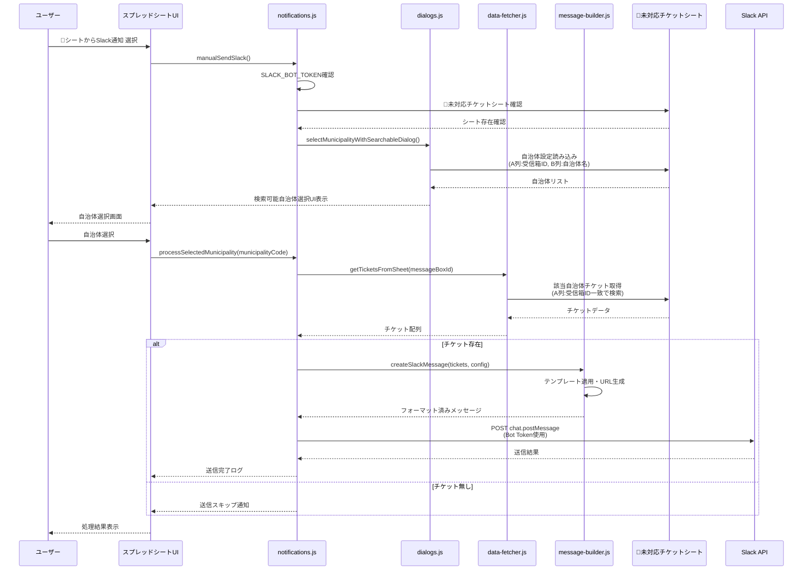
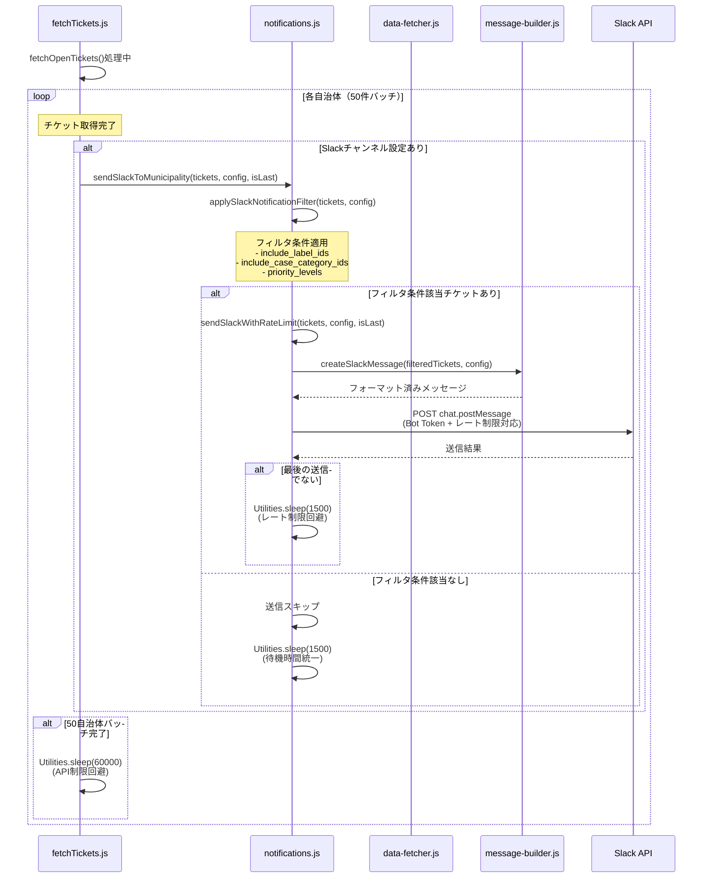

# Slack通知システムリファクタリング

## 概要

`slack_notification.js` の1200行を越える巨大なファイルを、機能ごとに分割してメンテナンス性を向上させました。

## 処理シーケンス

### 手動Slack通知フロー



### 自動Slack通知フロー（チケット取得時）



## 分割後のファイル構造

```
slack/
├── notifications.js    # メイン送信ロジックとAPI通信
├── message-builder.js  # メッセージ作成とテンプレート管理  
├── dialogs.js          # ユーザーインターフェース（ダイアログ等）
├── data-fetcher.js     # データ取得とマッピング
└── README.md           # このファイル
```

## データソースとAPI

### スプレッドシート
- **🎫未対応チケット**: チケット情報と自治体データの取得元
  - A列: 受信箱ID
  - B列: 自治体名
  - C列: チケットID
  - D列: チケットタイトル
  - E列: ステータス
  - F列: 担当者
  - G列: 作成日
  - H列: 更新日
  - I列: チケット分類
  - J列: ラベル

### Slack API エンドポイント
- **メッセージ送信**: `POST https://slack.com/api/chat.postMessage`
  - Bot Token認証
  - レート制限: 40回/分（安全マージン込み）
  - 送信間隔: 1.5秒（レート制限回避）

### 主要関数
- `manualSendSlack()`: 手動Slack送信のメイン関数
- `sendSlackToMunicipality()`: 自治体別Slack通知（フィルタ付き）
- `applySlackNotificationFilter()`: フィルタ条件適用
- `createSlackMessage()`: Slackメッセージ生成
- `getTicketsFromSheet()`: シートからチケット取得

## 各ファイルの詳細

### 1. `slack/notifications.js` (コア機能)
**責任範囲**: メイン送信ロジックとSlack API通信
- `manualSendSlack()` - 手動Slack送信のメイン関数
- `processSelectedMunicipality()` - 自治体選択後の処理
- `sendSlack()` - Slack通知送信
- `sendWithBotToken()` - Bot Token使用の送信処理
- `attemptSlackSend()` - Slack API呼び出し
- `sendSlackWithRateLimit()` - レート制限対応送信
- `sendSlackToMunicipality()` - 自治体別Slack通知（フィルタ付き）
- `applySlackNotificationFilter()` - フィルタ条件適用

### 2. `slack/message-builder.js` (メッセージ生成)
**責任範囲**: Slackメッセージの作成とテンプレート管理
- `createSlackMessage()` - Slackメッセージ作成
- `getSlackMessageTemplate()` - テンプレート取得
- テンプレートの置換処理
- チケットURL生成

### 3. `slack/dialogs.js` (ユーザーインターフェース)
**責任範囲**: ユーザー操作とダイアログ管理
- `selectMunicipalityWithSearchableDialog()` - 検索可能な自治体選択ダイアログ
- HTMLテンプレートとCSS/JavaScript
- 自治体検索・選択UI

### 4. `slack/data-fetcher.js` (データ処理)
**責任範囲**: データ取得とマッピング処理
- `getTicketsFromSheet()` - チケットデータ取得
- `getCaseCategoriesMap()` - チケット分類マップ取得
- `getLabelsMap()` - ラベルマップ取得
- `getCategoryNames()` - 分類ID→名前変換
- `getLabelNames()` - ラベルID→名前変換
- `parseIds()` - ID文字列パース
- `formatDate()` - 日時フォーマット

## 分割のメリット

### 1. **可読性の向上**
- 1200行 → 各ファイル200-400行程度
- 機能ごとの責任分離により理解しやすい
- 関数の役割が明確

### 2. **メンテナンス性の向上**
- 特定の機能のバグ修正時に該当ファイルのみ確認
- 新機能追加時の影響範囲が明確
- コードレビューが容易

### 3. **開発効率の向上**
- 複数人での同時開発が可能
- 機能単位でのテストが容易
- Git履歴の追跡が明確

### 4. **AI支援の向上**
- ファイルが小さくなりAIが理解しやすい
- 特定の機能について質問する際に該当ファイルのみ参照可能

## Google Apps Script での利用方法

Google Apps Scriptではモジュールインポートができないため、以下の方法で利用します：

### 方法1: 個別ファイルとして利用
各ファイルを独立したスクリプトファイルとしてGoogle Apps Scriptプロジェクトに追加

### 方法2: 必要な機能のみ統合
特定の機能のみ必要な場合、該当ファイルの関数を既存ファイルにコピー

### 方法3: 段階的移行
`slack_notification.js`から徐々に関数を移行し、最終的に分割ファイルに完全移行

## 従来ファイルとの互換性

現在の分割されたファイル構造は、以下の関数によってSlack通知機能を提供しています：

1. **段階的移行**: 新機能は分割ファイルで開発、既存機能は従来ファイルで維持
2. **選択的利用**: 必要な機能のみ分割ファイルから利用
3. **完全移行**: 全機能を分割ファイルに移行済み

## ディレクトリ構成

```
slack/
├── README.md                          # このファイル
├── notifications.js                   # メイン送信ロジック・API通信
├── message-builder.js                 # メッセージ作成・テンプレート管理
├── dialogs.js                         # 自治体選択UI・ダイアログ
└── data-fetcher.js                    # データ取得・マッピング処理
```

## 今後の開発指針

1. **新機能開発**: 分割されたファイル構造で開発
2. **バグ修正**: 該当する機能のファイルで修正
3. **機能拡張**: 責任範囲に応じて適切なファイルに追加
4. **コードレビュー**: 機能ごとのレビューが可能

## まとめ

この分割により、Slack通知システムの開発・保守が大幅に改善されました。各ファイルが特定の責任を持つため、AIによる理解も容易になり、効率的な開発が可能になります。
