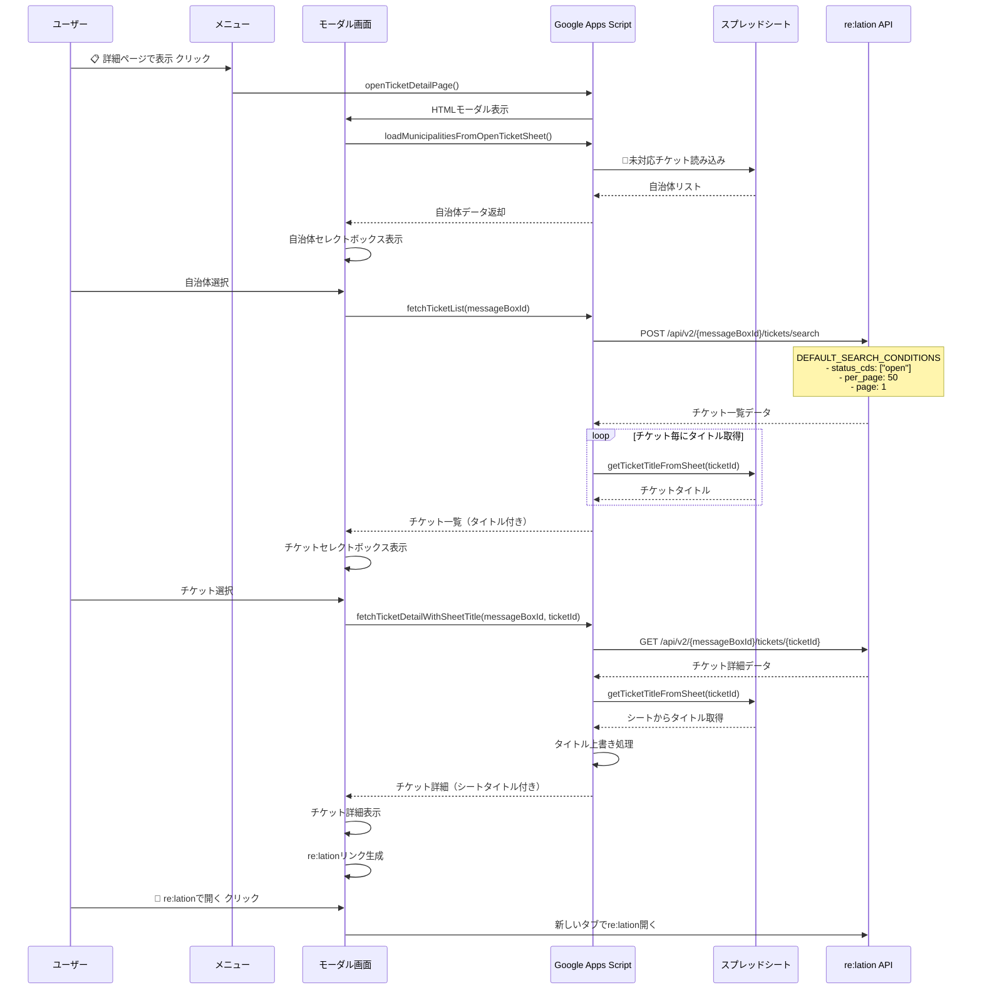

# チケットビューアー (ticket-viewer)

このディレクトリは、re:lationのチケット詳細を表示するUIモジュールです。

## 処理シーケンス



## データソースとAPI

### スプレッドシート
- **🎫未対応チケット**: 自治体一覧とチケットタイトルの取得元
  - A列: 受信箱ID
  - B列: 自治体名  
  - C列: チケットID
  - D列: チケットタイトル

### re:lation API エンドポイント
- **チケット検索**: `POST /api/v2/{messageBoxId}/tickets/search`
  - チケット一覧の取得
  - 検索条件: `status_cds: ["open"], per_page: 50, page: 1`
  
- **チケット詳細**: `GET /api/v2/{messageBoxId}/tickets/{ticketId}`
  - 個別チケットの詳細情報とメッセージ履歴

### 主要関数
- `openTicketDetailPage()`: モーダルダイアログ表示
- `loadMunicipalitiesFromOpenTicketSheet()`: 自治体一覧取得
- `fetchTicketList(messageBoxId)`: チケット一覧取得
- `fetchTicketDetailWithSheetTitle()`: チケット詳細取得
- `getTicketTitleFromSheet(ticketId)`: シートからタイトル取得

## ディレクトリ構成

```
ticket-viewer/
├── README.md                              # ディレクトリ説明
├── viewer_manager.js                      # メイン管理モジュール
├── viewer_page.html                       # UI表示ページ
├── viewer_page_css.html                   # CSS スタイル
└── viewer_page_js.html                    # JavaScript ロジック
```
